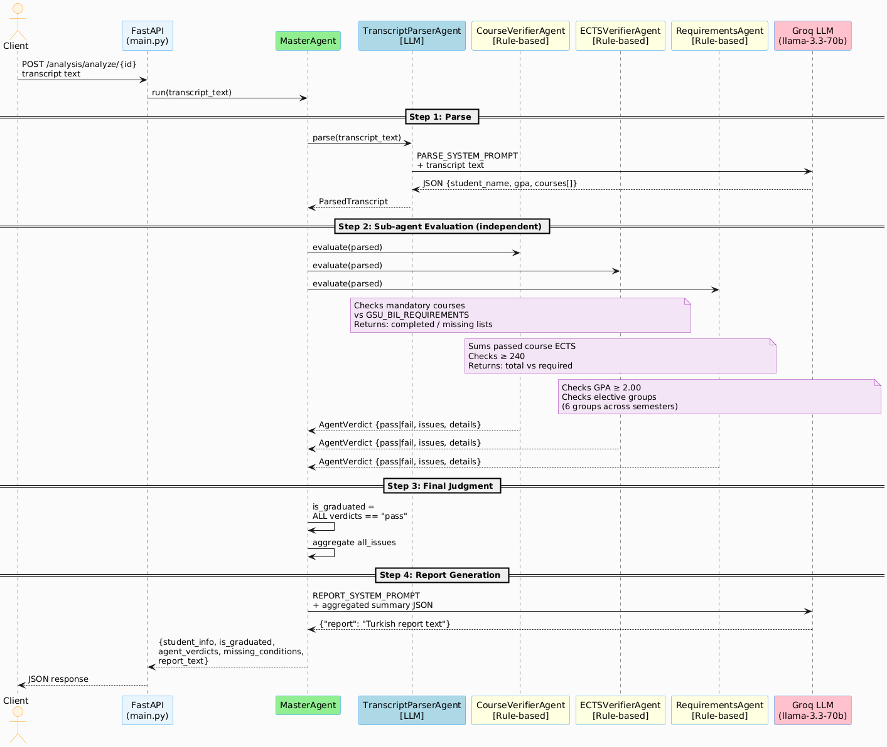

# GSU Virtual Academic Advisor

Graduation analysis system for the Computer Engineering department at Galatasaray University. Paste a student transcript and the system uses the Groq API (Llama 3.3) to analyze it, then reports graduation status and missing courses.

## Requirements

- Python 3.10+
- Node.js 18+
- Groq API key

## Setup

### Backend

```bash
cd backend
python3 -m venv venv
source venv/bin/activate
pip install -r requirements.txt
cp .env.example .env
# Add your GROQ_API_KEY to .env
```

### Frontend

```bash
cd frontend
npm install
```

## Running

Start both services with one command:

```bash
./run.sh
```

Or separately:

```bash
# Backend (inside backend/, venv active)
uvicorn main:app --reload --port 8000

# Frontend (inside frontend/)
npm run dev
```

- Backend: http://localhost:8000
- Frontend: http://localhost:5173
- API Docs: http://localhost:8000/docs

## Testing

You can run predefined transcript analysis scenarios using the included test script. This will validate if the analysis pipeline correctly determines graduation status for different student edge cases.

```bash
# From the project root, using the backend virtual environment:
./backend/venv/bin/python test_scenarios.py
```

## API Endpoints

| Method | Endpoint | Description |
|--------|----------|-------------|
| POST | `/transcripts/upload` | Upload transcript text, returns `transcript_id` |
| POST | `/analysis/analyze/{id}` | Run analysis, returns `analysis_id` |
| GET | `/analysis/{id}` | Fetch analysis result |
| GET | `/analysis/history` | List all past analyses |
| DELETE | `/analysis/{id}` | Delete analysis result and associated transcript |

## Architecture



Multi-agent analysis pipeline:

1. **Parse**: LLM (`TranscriptParserAgent`) extracts raw transcript text → structured JSON (student name, GPA, ECTS, completed courses).
2. **Evaluate**: Pure Python logic validates the structured data using `CourseVerifierAgent`, `ECTSVerifierAgent`, and `RequirementsAgent`.
3. **Report & Tool Calling**: LLM (`MasterAgent`) takes the validation results and generates a concise graduation report. **During this phase, the MasterAgent is equipped with native Tool Calling capabilities.** It can autonomously query the SQLite database (`check_student_history`) mid-generation to look up a student's past transcripts and adapt its final report based on their historical progress.

LLM calls use Groq API (`llama-3.3-70b-versatile`), dynamically switching between native Tool Calling and JSON mode for reliable structured output.

Database: SQLite (`backend/transcript_agent.db`), 3 tables: `students`, `transcripts`, `analysis_results`.

### Database Schema


